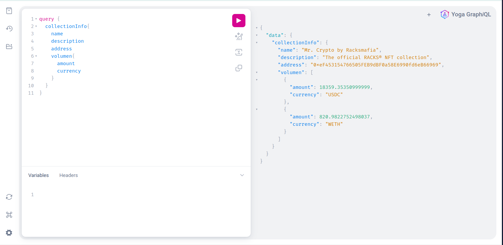

## ¿Qué es el Playground?

El Playground es una herramienta que te permite probar el funcionamiento del indexador de MrCrypto, haciendo petición de tipo GraphQL.

## ¿Cómo funciona?

Una vez tenemos el indexador en funcionamiento, podemos acceder al Playground a través de `localhost:4000`.

Al izquierda de la pantalla, podemos ver el panel de peticiones, donde podemos escribir las peticiones que queremos hacer al indexador.

Al lado derecho, podemos ver el panel de resultados, donde podemos ver el resultado de la petición que hemos hecho.



## Probar el funcionamiento

Para probar el funcionamiento, podemos hacer una petición de prueba, como por ejemplo la información general de colección:

```graphql
{
  collectionInfo {
    name
    description
    address
    volumen {
      amount
      currency
    }
  }
}
```

Resultado esperado

```json
{
  "data": {
    "collectionInfo": {
      "name": "Mr. Crypto by Racksmafia",
      "description": "The official RACKS® NFT collection",
      "address": "0xeF453154766505FEB9dBF0a58E6990fd6eB66969",
      "volumen": [
        {
          "amount": 18359.35350999999,
          "currency": "USDC"
        },
        {
          "amount": 820.9822752498037,
          "currency": "WETH"
        }
      ]
    }
  }
}
```

[Probar en vivo](https://indexer.mrcryptonft.com/?query=query+%7B%0A++collectionInfo%7B%0A++++name%0A++++description%0A++++address%0A++++volumen%7B%0A++++++amount%0A++++++currency%0A++++%7D%0A++%7D%0A%7D)
